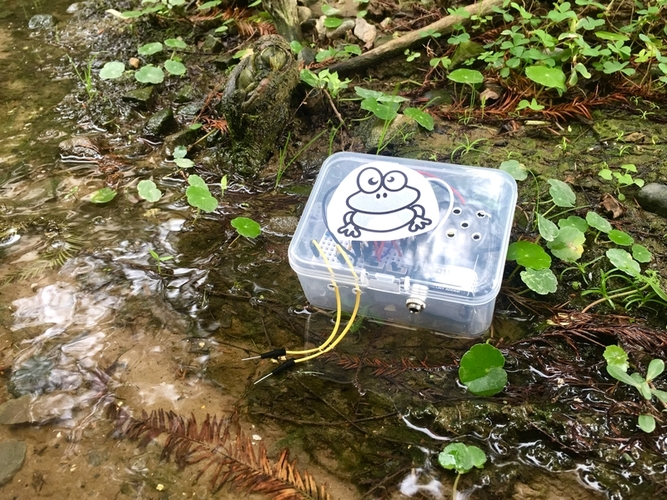
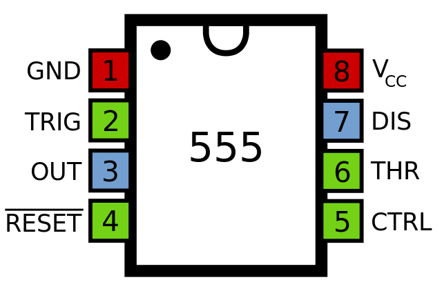
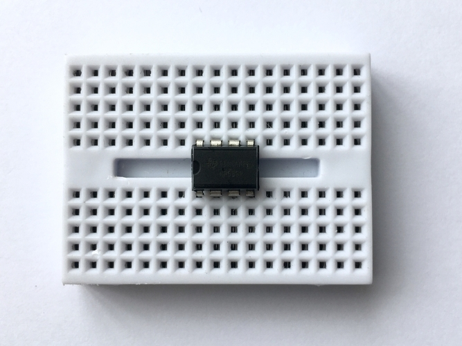

# 《WATERIA自助飲水站》Coqui 工作坊

---

[Coqui](https://publiclab.org/notes/warren/03-01-2019/build-a-sound-generating-coqui-conductivity-sensor) 由 Publiclab community 發想製作，是一個量測液體導電性的微型裝置。這個工作坊來自於「[Lab Kill Lab](https://lkl.clab.org.tw/concept)」計畫中的「[WATERIA自助飲水站](https://lkl.clab.org.tw/workstations)」。關於「Lab Kill Lab」計畫的構思與策畫請參考官網: https://lkl.clab.org.tw

## 關於這份文件

這份文件是配合 2020/12/14 在 C-LAB 所舉辦的《WATERIA自助飲水站 -- Coqui 工作坊》所製作的文件。在這份文件將會簡單介紹 Coqui，以及介紹如何製作出本次工作坊版本的 Coqui。在文件的後半段也將會介紹一些改裝的點子。

## Coqui 是什麼?

Coqui 是由 Publiclab community 所設計的 "液體導電性感測器" (Conductivity Sensor)。相較於一般的環境感測器裝置，Coqui 並不會顯示任何環境感測數據，而是以產生聲音的高低來傳達水質導電性的程度。水體中的電導率可以反映出水污染的程度。

另外，Coqui 所輸出的聲音是可以被錄製、分析、儲存，並可用於樂器演奏的。在這個工作坊中將示範如何製作一個 Coqui 導電性感測器。

[Coquí](https://en.wikipedia.org/wiki/Coqu%C3%AD) 的命名來自多明尼加樹蛙 (Eleutherodactylus Coqui)。是原產於波多黎各的一種相當小的樹蛙。多明尼加樹蛙求偶的叫聲就像牠的學名 “Coquí” 一樣，有二個明顯的高音 “co-kee”，在 0.5 公尺的範圍內可達將近 100 分貝。

## 開始製作 Coqui

### 準備材料

#### 基本材料

* 555 計時器 IC (Timer IC) x1
* 20KΩ 1/4W ±5% 碳膜電阻 (Carbon Film Resistor) x1
* 0.1uF 陶瓷電容 (Capacitors) x1
* 壓電式蜂鳴器 (工作電壓 1~30V) x1
* 9V 碳鋅電池 x1
* 9V 電池盒 (或電池扣) 含導線 x1
* 170 孔迷你麵包板 x1
* 10cm 公對公杜邦線 x4
* 20cm 公對公杜邦線 x2

#### 改裝用材料 (有需要才增加)

* 光敏電阻 x1
* 10~100K 以內的可變電阻 x1
* 撥動開關 x2
* 塑膠外殼
* 3.5mm 音源輸入孔焊接插座 x1
* 10cm 公對公杜邦線 x3

ps: 在實體工作坊中會帶大家以 "基本材料" 製作出最基本的 Coqui。關於進階的改裝步驟會記錄在這份線上文件的後半段，可根據上述的 "改裝用材料" 列表採買所需零組件。

### 動手做

## Coqui 改裝

### 外殼與電源切換

### 增加音頻輸出

## Coqui 的其它發想

## 技術補充 -- 如何簡單決定音頻